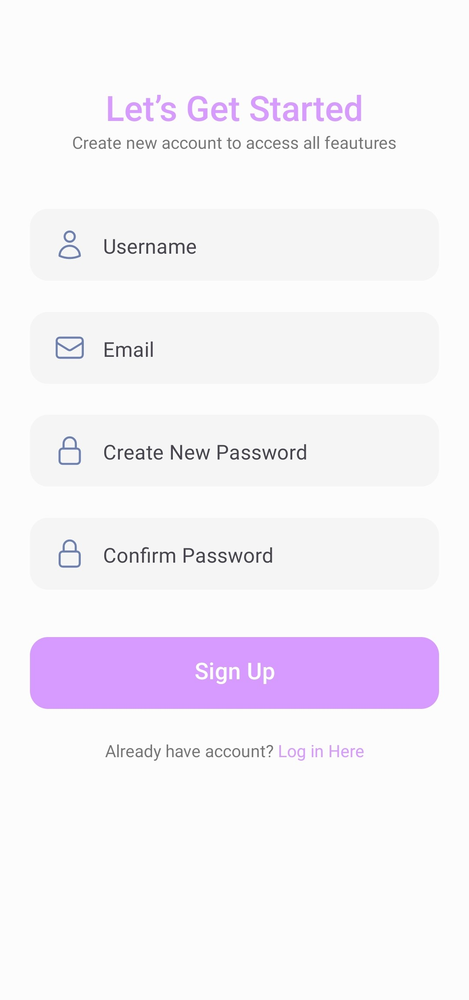
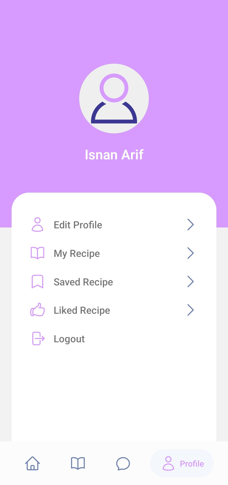
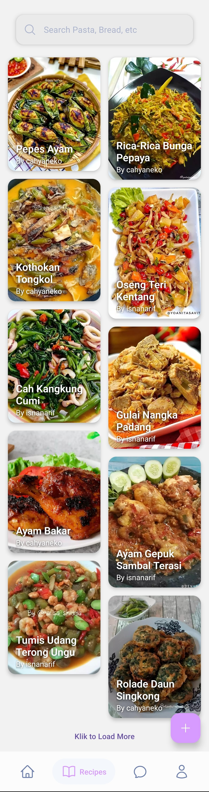

# Pijar Cooking Web ver

## Table of Contents

- [Introduction](#introduction)
- [Demo](#demo)
- [Technologies Used](#technologies-used)
- [Installation](#installation)
- [Configuration](#configuration)
- [Features](#features)
- [Screenshot](#screenshot)
- [Related Project](#related-project)
- [Authors and Contact Info](#authors-and-contact-info)

## Introduction

Pijar Cooking is a web-based application using React JS technology and also has a mobile-based application using React Native that is connected to a backend system and the same database so that users can choose to use the web or mobile versions of the application. Pijar Cooking is aimed at young people, both men and women, who want to learn to cook and want to share the dishes and recipes they have found or learned with everyone. Not only that, Pijar Cooking can be used by mothers who want to cook for their beloved family so that there will be warmth and harmony in the family. Presented with a family friendly user interface that looks fun and navigation that is easy for both young people and mothers to use. Accompanied by video tutorials to make cooking sessions much more fun and clear. There is a chat feature with fellow users available on the mobile version with the aim that fellow users can interact by simply saying hello, giving direct appreciation for recipes that have been made, or asking for assistance.

## Demo

Visit the link below for demo.

:iphone: [Pijar Cooking Mobile ver](https://github.com/isnancahyadi/pijar-cooking-mobile/releases/tag/v1.0.0)

## Technologies Used

The project utilizes the following technologies and libraries:

- React Native: A JavaScript framework for building native mobile apps for Android and iOS platforms.
- Node.js: The JavaScript runtime that powers the server-side backend and API.
- Axios: A promise-based HTTP client for making API requests from the app.
- React Native Navigation: A navigation library for managing navigation between screens.
- Firebase: A cloud-based platform for authentication, real-time database, and storage.
- React Native Encrypted Storage: A library for securely storing sensitive data on the device.
- Redux: A state management library to efficiently manage application state.
- React Hook Form: A library for handling form validation and form state in React Native.
- React Native Paper: A library providing ready-to-use UI components for a material design.
- React Native Gifted Chat: A library for implementing chat interfaces in the app.

## Installation

1. Clone this repository to your local machine:

```bash
git clone https://github.com/isnancahyadi/pijar-cooking-mobile.git
cd pijar-cooking-mobile
```

2. Install the required dependencies using npm or yarn:

```bash
npm install
# or
yarn install
```

## Configuration

Before running the application, you need to set up the Firebase configuration for authentication and data storage. Add your Firebase configuration to the `firebase.js` file located in the project's source code. For more detail about installation and configuration firebase, please visit official documentation in https://firebase.google.com/.

## Features

- User Authentication: Allow users to sign up, log in, and manage their profiles.
- Recipe Browsing: Users can browse a list of recipes and view recipe details.
- Real-time Chat: Users can interact with other users through real-time chat using React Native Gifted Chat.
- Secure Data Storage: Sensitive data is securely stored using Native Encrypted Storage.
- Responsive Design: The app is designed to work seamlessly on both Android and iOS devices.

## Screenshot

<table>
    <tr>
        <td>1. Register Account Screen</td>
        <td>2. Register Profile Screen</td>
        <td>3. Login Screen</td>
    </tr>
    <tr>
        <td>
            
        </td>
        <td>
            
        </td>
        <td>
            
        </td>
    </tr>
    <tr>
        <td>4. Profile Screen</td>
        <td>5. Home Screen</td>
        <td>6. List Recipes Screen</td>
    </tr>
    <tr>
        <td>
            
        </td>
        <td>
            
        </td>
        <td>
            
        </td>
    </tr>
    <tr>
        <td>7. Detail Recipe Screen</td>
        <td>8. Chat Screen</td>
    </tr>
    <tr>
        <td>
            
        </td>
        <td>
            
        </td>
    </tr>
</table>

## Related Project

- :desktop_computer: [Pijar Cooking Website ver](https://github.com/isnancahyadi/pijar-cooking-web-v3)
- :link: [Pijar Cooking API](https://github.com/isnancahyadi/pijar-cooking-api-v2)

## Authors and Contact Info

For more information about this project or have any question or need help for development, feel free to contact me.

Isnan Arif Cahyadi

<div id="badges">
  <a href="https://www.linkedin.com/in/isnanarifcahyadi/">
    
  </a>
  <a href="mailto:isnan.arifc@gmail.com">
    
  </a>
</div>
